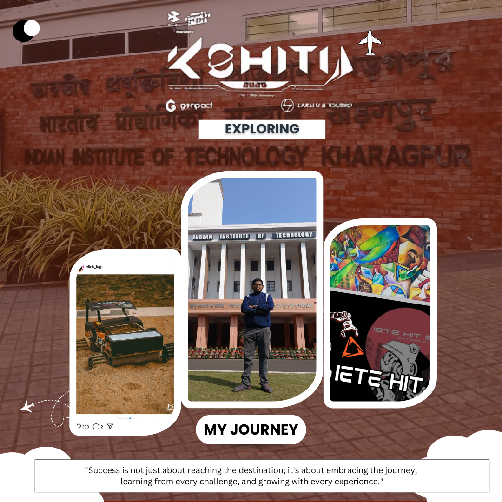

# 🚗 Sand Rover – Semi-Autonomous Robot with Custom 11-Channel Controller

  
  
  
  
  

---

## 🏆 Achievements
- ✅ **Secured 31st position at IIT KGP Techfest** 🎉

---

## 📌 Project Overview
**Sand Rover** is a custom-built semi-autonomous robotic vehicle controlled using a **self-designed 11-channel controller**.  
It leverages **NRF24L01** modules for **long-range wireless communication**, providing high responsiveness and reliability.

The custom transmitter integrates:
- **2 Joysticks** (for motion control)
- **3 Buttons** (for extra functions)

---

## 📸 Project Photo

  

---

## 🔧 Hardware Components

### 🖥 Microcontrollers
- **Arduino Uno** – Main processing unit  
- **Arduino Nano** – Manages data transmission and reception  

### 📡 Communication Modules
- **NRF24L01 (Long-Range Version)** – For wireless data transmission  
- **UART Protocol** – For data sharing between receiver and main microcontroller  

### 🎮 Controller & Mechanism
- **Custom 11-Channel Controller** – Designed from scratch for precise control  
- **2 Joysticks** – Control direction and speed  
- **3 Buttons** – Handle special functionalities  

### ⚙️ Motor Control
- **BTS7960 Motor Driver Modules** – For powerful and precise motor control  

### 🔋 Power Supply
- **2200mAh LiPo Battery** – Powers the entire system  

---

## 🎮 How It Works
1. **Transmitter** sends signals via **NRF24L01**.
2. **Arduino Nano (Receiver)** receives data and forwards it to **Arduino Uno** over **UART**.
3. **Joysticks** control the direction and speed.
4. **Buttons** trigger additional functionalities.
5. **BTS7960 Motor Drivers** execute movement commands.

---

## 📌 Features
- ✅ **Custom 11-Channel Controller** for advanced control
- ✅ **Dual Joystick & Button Controls** for flexible operations
- ✅ **Long-Range Wireless Communication** with NRF24L01
- ✅ **Compact, Efficient & Powerful** – Runs on a 2200mAh LiPo Battery
- ✅ **Proven in Competition** – Successfully performed at IIT KGP Techfest

---

## 🚀 Future Enhancements
- ➕ Advanced Speed Control using **PID algorithms**
- ➕ **FPV Camera Integration** for real-time vision
- ➕ **Autonomous Navigation Mode** with AI-based decision making

---

## 📜 License
This project is licensed under the **MIT License**.  
See the [LICENSE](LICENSE) file for more details.

---

## 🔧 Developed By
**Arijit Dutta**

📅 **Last Updated:** March 21, 2025
